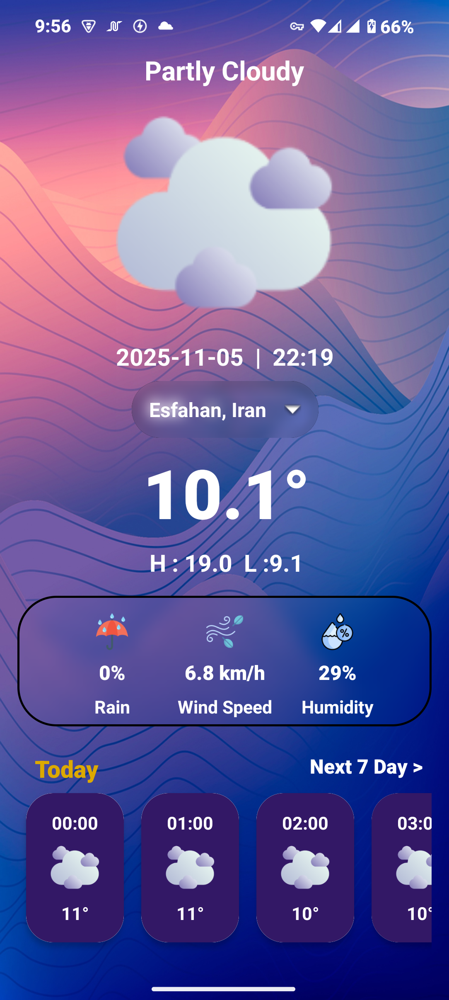
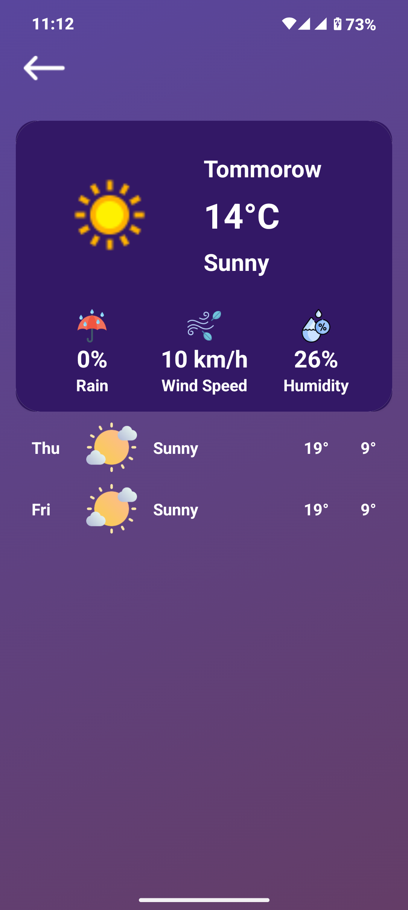
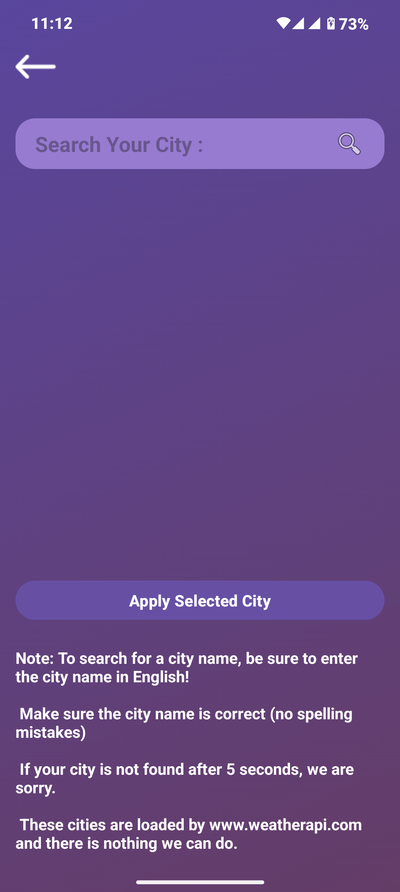

# برنامه اندرویدی نمایش آب‌ و هوا

یک اپلیکیشن اندرویدی مدرن و زیبا به زبان جاوا که با استفاده از WeatherAPI وضعیت کامل و دقیق آب‌ و هوای شهرهای سراسر جهان را نمایش می‌دهد. طراحی رابط کاربری تمرکز ویژه‌ای روی وضوح، مدرنیته و تجربه کاربری دلنشین دارد.

## قابلیت‌ها

- **انتخاب تمام شهرهای جهان**: پشتیبانی کامل از جستجو و انتخاب هر شهری روی کره زمین.  
- **نمایش وضعیت فعلی آب‌ و هوا**: شامل دما، وضعیت آسمان، آیکون‌ها و جزئیات مهم.  
- **رابط کاربری فوق‌العاده مدرن و چشم‌نواز**: استفاده از افکت‌های Blur و طراحی تمیز.  
- **نمایش تاریخ و ساعت دقیق**  
- **نمایش دمای فعلی به سلسیوس**  
- **نمایش کمترین و بیشترین دمای روز**  
- **نمایش احتمال بارش باران**  
- **نمایش سرعت باد**  
- **نمایش رطوبت هوا (Humidity)**  
- **پیش‌بینی 24 ساعت آینده**: نمایش وضعیت آب‌ و هوا از لحظه فعلی تا ۲۴ ساعت بعد همراه با دما، وضعیت آسمان و تغییرات احتمالی.  
- **نمایش وضعیت آب‌ و هوای فردا**  
- **نمایش پیش‌بینی کامل ۷ روز آینده** همراه با همه جزئیات لازم

## تکنولوژی‌ها و ابزارها

- زبان برنامه‌نویسی: **Java**  
- محیط توسعه: **Android Studio**  
- API داده‌های آب‌ و هوا: **api.weatherapi.com**  
- کتابخانه افکت Blur:  
  `com.github.wonderkiln:blurkit-android:1.1.1`

---

## اسکرین‌شات‌ها

## نکات 
- **api خود را در کلاس  `Config.java` تنظیم کنید**

# Android Weather App

A modern and beautifully designed Android application written in Java that uses WeatherAPI to display accurate and detailed weather information for any city around the world. The user interface focuses on clarity, modern design, and a smooth user experience.

## Features

- **Search and select any city worldwide**: Full support for global city lookup.  
- **Current weather conditions**: Displays temperature, sky status, icons, and essential weather details.  
- **Ultra-modern and visually appealing UI**: Includes blur effects and a clean, polished design.  
- **Accurate date and time display**  
- **Temperature in Celsius**  
- **Today's minimum and maximum temperature**  
- **Chance of rain**  
- **Wind speed**  
- **Humidity level**  
- **24-hour forecast**: Shows weather conditions from the current hour up to the next 24 hours, including temperature changes and sky conditions.  
- **Tomorrow's weather forecast**  
- **7-day detailed weather forecast** with all necessary information  

## Technologies & Tools

- Programming Language: **Java**  
- IDE: **Android Studio**  
- Weather API Provider: **api.weatherapi.com**  
- Blur Effect Library:  
  `com.github.wonderkiln:blurkit-android:1.1.1`

---

## Notes
- **Set your API key inside the `Config.java` class**
